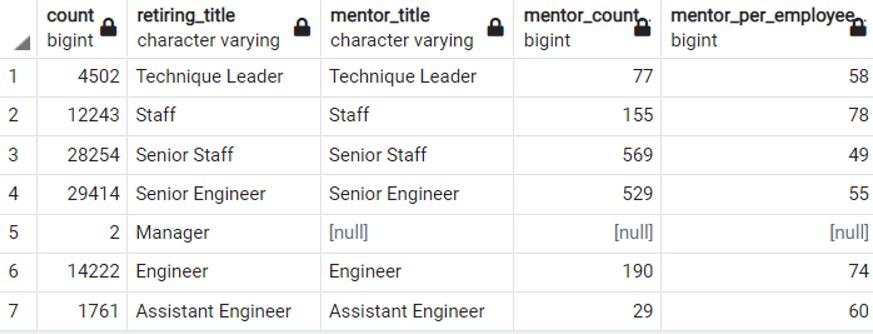

# Pewlett-Hackard-Analysis using postgreSQL

## Purpose :
 The purpose of this analysis is to figure out the number of retiring employees by the most recent title and the employees eligible for the mentorship program.
 ### Overview of the analysis: 
 This report will help Pewlett Hackard company with the presented results and prepare them for the upcoming "silver tsunami" by seeing the big picture with numbers, ratios and tables. PH will be presented with table overview using the ERD to give them overall relation of the table, as well retirement age employees by most recent job titles and mentorship tables with job titles, numbers, ratios and percentages.

## Results:  
 Using quickdatabasediagrams.com site Entity Relationship Diagram is created as seen in the image below. Using this flowchart we can highlights different tables and their relationships to each other and Primary keys, Foreign keys and data types for each column and present to Pewlett Hackard company for verifications.

Pewlett Hackard company tells us that employees who were born between January 1, 1952 and December 31, 1955 are retirement age employees. I can see in the PH given tables that some employees have had multiple titles due to promotions. I can also see that the tables include all hired employes, including ones who are not with the company anymore. When we count all employees we know that PH have had 300,024 employees which only 240,024 are currently working with PH. We were told that "to_date" field gives us the information if an employee is still with PH, ie. to_date equal to '9999-01-01' means that the employee is still with the company. Using these information I included only current employees and their most recently held titles in the retirement age table.The below image is the result of the retirement age titles and numbers.

Mentorship program will help the "silver tsunami" problem. PH suggest that employees who are eligible to participate in a mentorship program must be born in 1965. This limits the number of mentors for 90,398 new employees. Using this information I created a mentorship eligibility table that holds 1549 employees who are eligible to participate and their information including titles. The below image displays the mentorship eligibility information.

### Major points from the analysis:
1. 1761 out of 3588 Assistant Engineer positions, which means the 49 percent of the AE position will retire. When compared to company wide employee percentage the percentage of AE is only %1 and percentage of retiring AE is less insignificant around zero which means out of 240,124 employees only below one percent is AE position. 2 out of 9 managers will retire and will have the low impact on the company overall retiring percentage and on retiring titles. These positions will have a higher replacement priority.
2. PH employs 85939 Senior Engineer and 29414 of them will retire.  35 percent of total employees are SE and 34 percent of currently working SE will retire. This will have a big impact on PH Senior Engineer work. The same analysis can be said for the senior staff. 34 percent of PH helds SS position and 34 percent of the currently working SS position will retire. The SS and SA will make up the 12 percent and 11 percent of the total retiring groups which are the highest. These positions need to be filled with a higher priority. The below tables proved the explained points.

3. PH would like to create a mentorship eligibility program that allows the current employees who were born between January 1, 1965 and December 31, 1965. to be mentors. Total number of people who are retiring and eventually need to be replaced is 90398. PH has total of 1549 mentor for 90,398 new employee. That means they will have one mentor for every 58 new employee they hire. This ratio is quite high. 

4. When the number of mentors are catogorized by title we have a better picture of the percentage of mentors versus number of employees to be trained. According to query result that shows the percentage of mentors for employees below PH will have one Staff mentor to train 78 new employees. PH will need one mentor to train 74 Engineer positions. These numbers are quite high. There is no mentor available for manager position. PH might want to outsource the training employees or higher new employees to as mentors or hire employees at different time slots to have enough mentors.

## Summary: 
In summary PH need to prepare for the 90398 retirement aged positions out of 240,124 employees. Out of 240,124 employees only 1549 qualified for mentorship participation.

### Issues to address:
- PH will need 90398 positions to be filled as "silver tsunami" begins to make an impact. The ratio for the retiring titles compared to currently working employees and compared to retiring titles can be seen below as a result of a query. According to the table the highest number of retirement ready positions are in Senior Engineer and Senior Staff departments followed by Engineers and Staff.

- There are 1549 qualified mentors for 90398 retirement-ready employees in all departments to mentor next generation of PH employees. The ratio of mentor-trainee is 58 and this number is big. Especially for the Staff department there is one mentor for 78 trainee and 74 for the Engineers title. The ratio of the mentor-trainee can be seen as a result of a query in the below image. This information tells us that the number of mentors are not sufficient.

